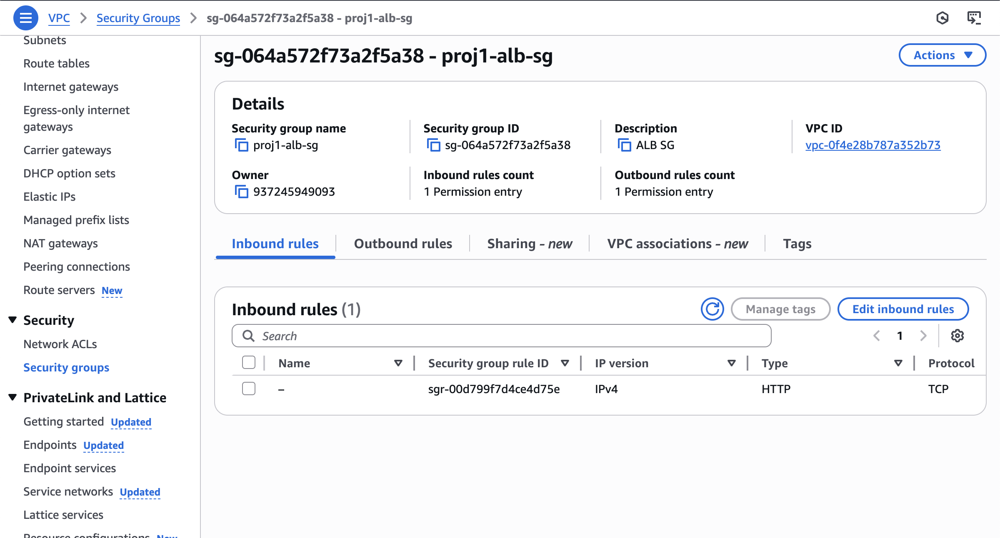
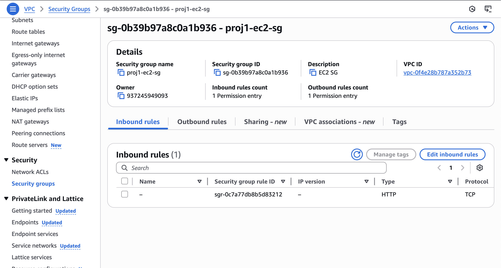
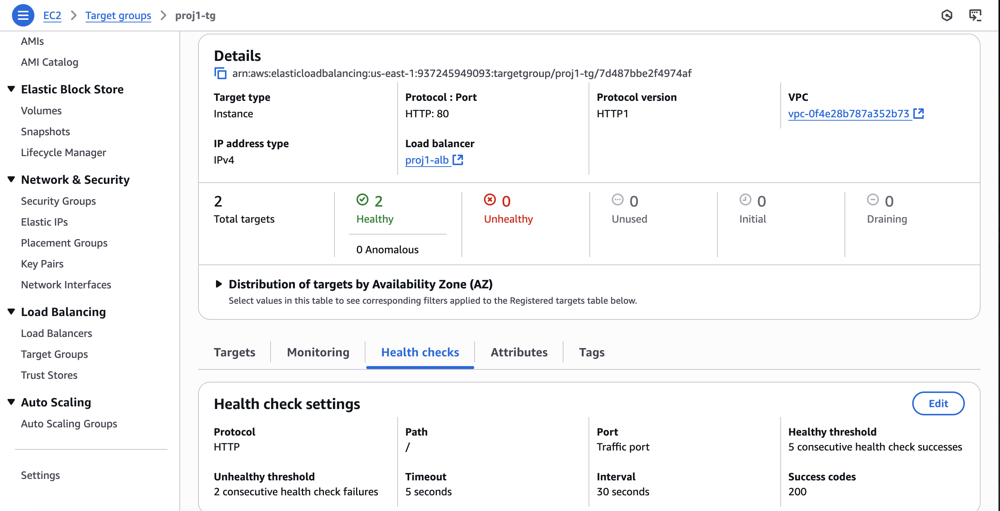
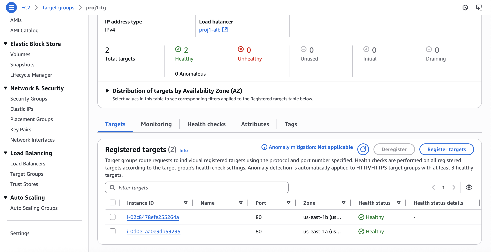
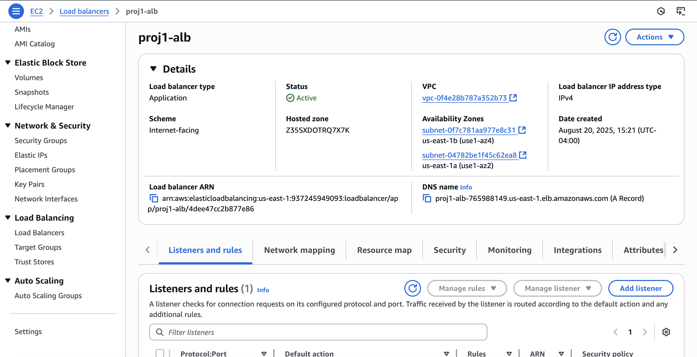
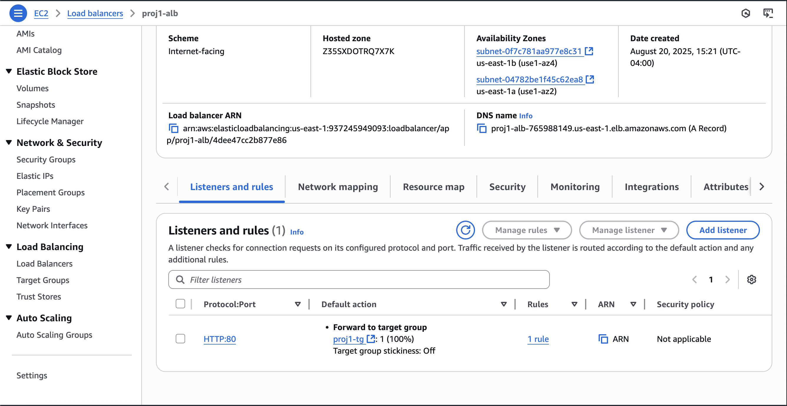
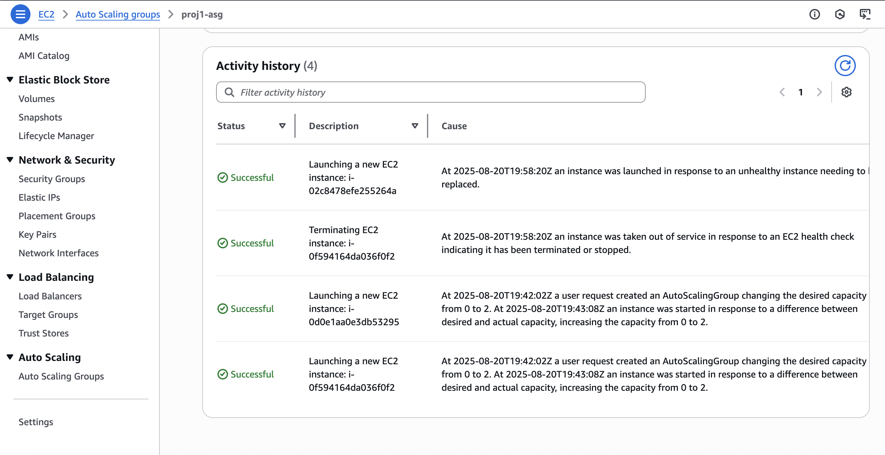
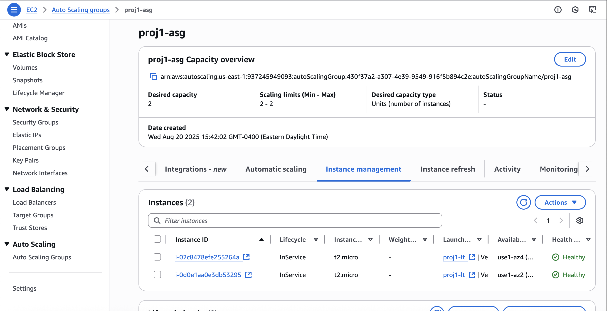
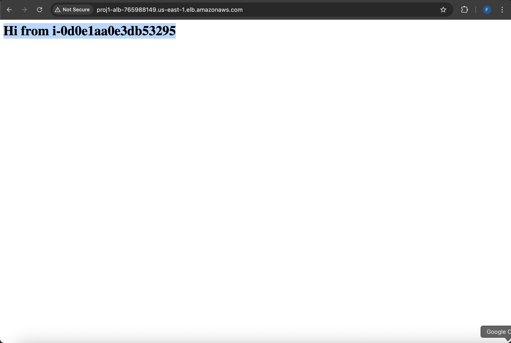
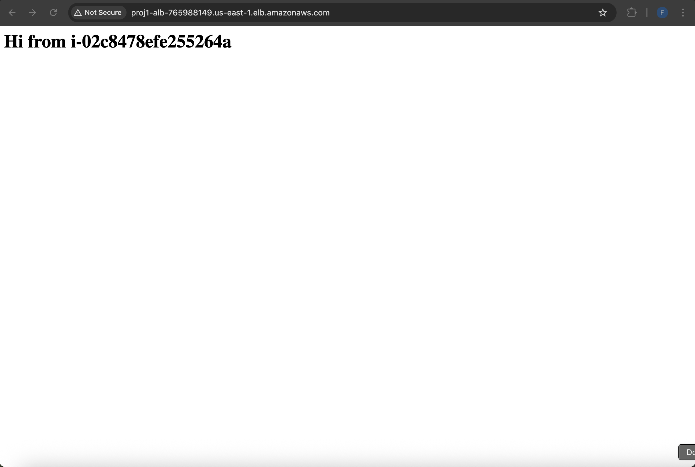

Highly Available Web App on AWS (ALB + ASG)

Audience: hiring managers, small-business clients, junior engineers
Promise: a small, production-style, auto-healing web stack built entirely in the AWS Console — clear, auditable, and easy to demo.

1) TL;DR — What This Does (in plain English)

One public door: the Application Load Balancer (ALB) is the only thing exposed to the internet.

Two servers (in 2 data centers): the Auto Scaling Group (ASG) keeps 2 EC2 instances alive across two Availability Zones.

If one breaks: the ALB stops sending it traffic and the ASG creates a new one automatically.

Locked-down access: servers do not accept traffic from the internet; they accept port 80 only from the ALB (security-group to security-group).

2) Why This Matters (business outcomes)

Stays online: one server can die and the site keeps running.

Low-touch operations: no SSH needed; instances bootstrap themselves with User Data.

Safer by default: public traffic hits the ALB, not the servers.

Easy to hand off: screenshots + runbook + cleanup give clients confidence.

3) What’s Included (deliverables)

ALB (HTTP :80) across 2 AZs

Target Group (health check /)

ASG (2× t2.micro, min=2, max=2) with ELB health checks

Launch Template (Amazon Linux 2023) + User Data (installs Apache, prints instance ID)

Security Groups:

proj1-alb-sg → inbound 80 from 0.0.0.0/0

proj1-ec2-sg → inbound 80 only from proj1-alb-sg (SG-as-source)

Docs: short Runbook and Cleanup

Evidence: screenshots below

4) How Traffic Flows (step-by-step)

User requests your ALB DNS name.

ALB checks which servers are healthy in the Target Group.

ALB forwards the request to a healthy server.

If a server stops responding, ALB marks it unhealthy and stops sending traffic.

ASG notices you’re below desired capacity and launches a replacement.

When the new server passes health checks, it starts serving traffic.

5) Architecture (at a glance)
<pre><code>Internet │ ▼ [ Application Load Balancer :80 ] │ (sg: proj1-alb-sg — inbound 0.0.0.0/0 on :80) ▼ [ Target Group ] — Health check: HTTP GET "/" │ ▼ [ Auto Scaling Group (2× EC2, 2 AZs) ] ├─ [ EC2 #1 ] (sg: proj1-ec2-sg — allows :80 only from ALB SG) └─ [ EC2 #2 ] (sg: proj1-ec2-sg) </code></pre>
6) Implementation Details (reviewer-friendly)

Launch Template — User Data (Amazon Linux 2023):

<pre><code>#!/bin/bash set -euxo pipefail dnf -y update dnf -y install httpd # IMDSv2 token for metadata TOKEN=$(curl -sS -X PUT "http://169.254.169.254/latest/api/token" -H "X-aws-ec2-metadata-token-ttl-seconds: 21600") INSTANCE_ID=$(curl -sS -H "X-aws-ec2-metadata-token: $TOKEN" http://169.254.169.254/latest/meta-data/instance-id) echo "&lt;h1&gt;Hi from $INSTANCE_ID&lt;/h1&gt;" &gt; /var/www/html/index.html systemctl enable httpd systemctl start httpd </code></pre>

Target Group Health Check: HTTP, Path /, Success 200
ASG Health Settings: Type = ELB, Grace Period ≈ 120s

7) Evidence (screenshots)

Security Groups

Target Group

Load Balancer

Auto Scaling Group

App Proof (refresh shows different IDs)

8) How To Demo (2 minutes)

Refresh the ALB DNS; watch the instance ID change between two servers.

Terminate one instance (EC2 → Instances) to simulate failure.

Watch Target Group → Targets: one drains/unhealthy, the other stays healthy.

Watch ASG → Activity: it launches a replacement. The site stays up.

Docs: See docs/runbook.md

9) Cleanup (avoid charges)

Delete in this order: ASG → Launch Template → ALB → Target Group → Security Groups
Docs: docs/cleanup.md

Tip: for portfolio demos, capture screenshots/video, then tear down.

10) Cost Notes (honest & small)

The ALB has a small hourly cost.

t2.micro may be Free Tier (depending on your account).

Keep the stack online only for demos; otherwise tear down.

11) What I Practiced / Learned (résumé-ready)

Designed & deployed a multi-AZ, auto-healing web stack on AWS (ALB + ASG) with least-privilege networking.

Automated server bootstrap (Amazon Linux 2023 + Apache) via User Data; validated auto-healing by termination and replacement.

Produced a runbook & cleanup and captured evidence screenshots for auditability and client hand-off.

12) Who This Helps

Small businesses / creators who want uptime without heavy ops.

Teams needing a minimal, auditable HA baseline before adding HTTPS, alarms, or CI/CD.

Early-career engineers who want a clear, demonstrable HA reference build.

13) Roadmap (simple add-ons)

HTTPS + domain: ACM certificate + :443 listener (redirect :80 → :443)

Path-based routing: route /api* to a second target group (different port)

Observability: CloudWatch alarms (ALB 5xx, UnHealthyHostCount) & basic dashboards

Blue/Green: new Launch Template versions with rolling updates

14) Repository Structure
<pre><code>. ├─ README.md ├─ docs/ │ ├─ runbook.md │ └─ cleanup.md └─ screenshots/ ├─ 01-sg-alb-inbound.png ├─ 02-sg-ec2-inbound.png ├─ 03-tg-healthcheck.png ├─ 04-tg-healthy-targets.png ├─ 05-alb-description-dns.png ├─ 06-alb-listener.png ├─ 07-asg-activity-replace.png ├─ 08-asg-instances-inservice.png ├─ 09-app-instanceA.png └─ 10-app-instanceB.png </code></pre>
